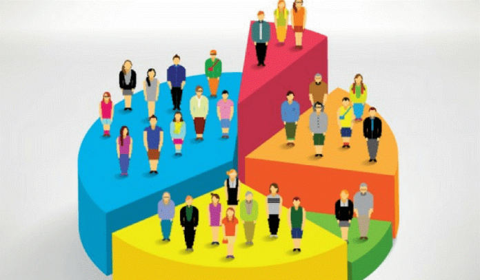

# Segmentación de Clientes con una base de datos de kaggle

En este proyecto, realizaré un agrupamiento no supervisado de datos en los registros de los clientes de una base de datos de una empresa de comestibles. La segmentación de clientes es la práctica de separar a los clientes en grupos que reflejan similitudes entre los clientes en cada grupo. Dividiré a los clientes en segmentos para optimizar la importancia de cada cliente para el negocio. Para modificar los productos de acuerdo a las necesidades y comportamientos distintos de los clientes. También ayuda al negocio a atender a las preocupaciones de diferentes tipos de clientes.

[*Datos*.](https://www.kaggle.com/datasets/imakash3011/customer-personality-analysis)
